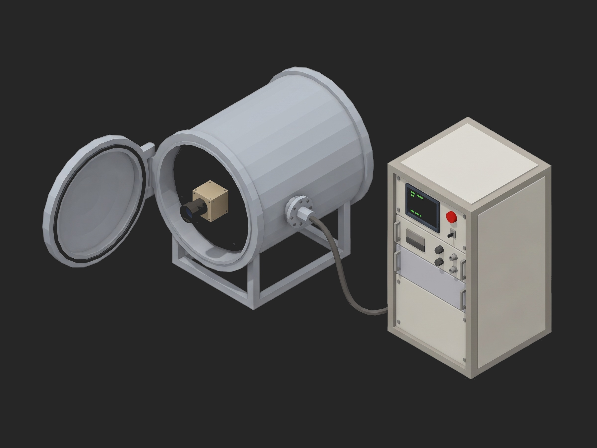

# Framework TVAC Bakeout and Thermal Cycling



A TofuPilot Framework procedure for a thermal vacuum run on a smallsat star tracker: pump-down to the ECSS pressure with the time to vacuum recorded, a bakeout at +60 °C with a TQCM witness at -20 °C judged on the outgassing rate at the end, the clean window and the total mass collected, four acceptance thermal vacuum cycles with a centroid check on a simulated star and the bus power at every hot and cold dwell, and a dry-nitrogen backfill gated on the unit being above the dew point. The mock bench synthesizes a healthy unit whose outgassing rate decays from 40 Hz/h with an 8 h time constant.

## What This Shows

| Feature | Where |
|---------|-------|
| A derived curve stored next to the raw one, with the limits on the derivative | `bake` -- `tqcm` (raw), `rate` (2 h slope, `final_hz_per_h`, `clean_window_h`) |
| A duration window as two validators on one aggregation | `bake.tqcm.duration_h` in 36 to 72 |
| A count validated with `==` and a level reached validated as a window | `profile.unit.cycles == 4`, `max_c` in 54 to 58 |
| A curve with no aggregation kept for the record next to two that are judged | `dwells` -- `temperature`, `centroid` (`max_arcsec`), `power` (`max_w`) |
| A teardown gate that protects the hardware | `backfill` -- `unit_temp_backfill_c >= 15` |
| Very small numbers as limits | `pumpdown.pressure.final_hpa <= 1.0e-5` |
| Progress components on three time-scaled long phases, 24 h phase timeout cap | `pump_down`, `bakeout`, `tvac_cycling` |

## Get Started

1. Sign up for a free TofuPilot account at [tofupilot.app](https://www.tofupilot.app/auth/signup).
2. Open the **New Procedure** flow in the dashboard and clone this template.
3. Follow the dashboard's instructions to set up a station and run the procedure.

For deeper guides, see the [TofuPilot docs](https://www.tofupilot.com/docs/framework) and the [TVAC Bakeout and Thermal Cycling template page](https://www.tofupilot.com/templates/tvac-bakeout-and-thermal-cycling).

## Structure

```
.
├── procedure.yaml                    # Procedure, plug, phases, measurements
├── phases/
│   ├── identify.py                   # Setup: firmware, unit temperature, chamber at ambient
│   ├── pump_down.py                  # Pressure curve, time to vacuum
│   ├── bakeout.py                    # TQCM frequency, outgassing rate, clean window
│   ├── tvac_cycling.py               # 4 cycles, profile, functional check at each dwell
│   └── backfill.py                   # Teardown: dry nitrogen once above the dew point
├── plugs/
│   └── tvac_bench.py                 # Mock chamber + gauge + TQCM + tracker link
├── utils/
│   └── recipe.py                     # Pressure, bake, TQCM criteria, cycle levels
├── pyproject.toml                    # uv-managed Python project
└── README.md
```

## Replace the Mock with Real Hardware

`plugs/tvac_bench.py` maps to the chamber controller over Modbus (shroud, plate, valves), the ion gauge over RS-232, the QCM controller over its serial protocol, and the tracker's Ethernet link for power, temperature and the centroid of the simulated star. Set `TIME_SCALE = 1.0` in `utils/recipe.py`. A phase timeout is capped at 24 h, so a real bakeout is run as daily segments of the `bakeout` phase or read back from the chamber's logger at the end; the aggregations are the same either way. Set the TQCM rate, window and total-shift figures to the programme's contamination control plan. The phases, measurements and limits stay the same.
